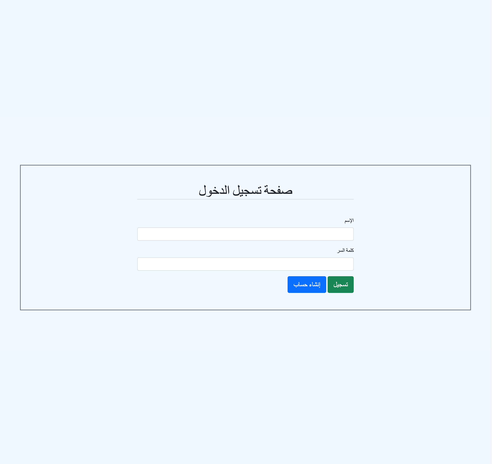
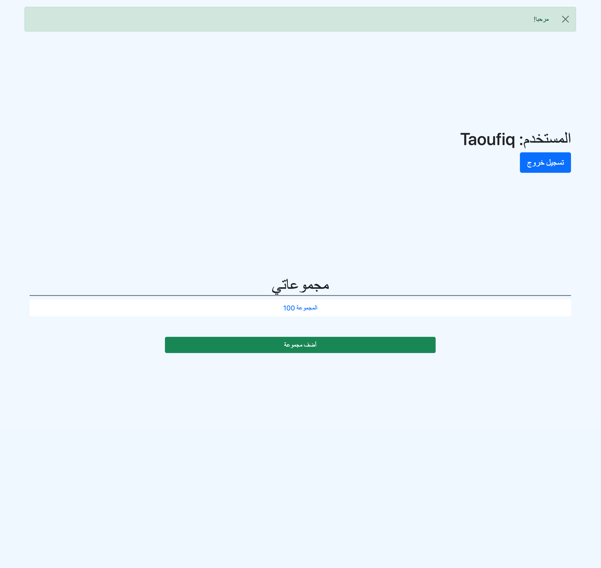
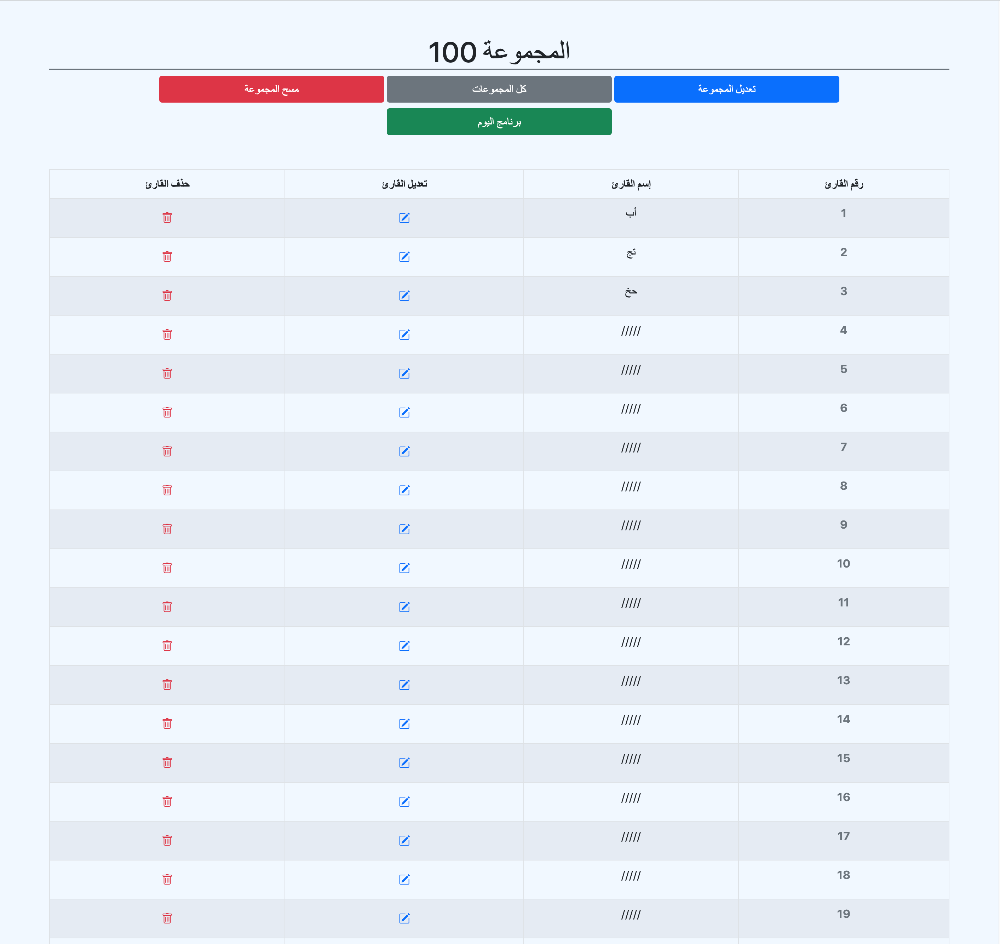

# QuranGroups





```
This is a small Fullstack app using JavaScript for the frontend and the backend.
```
```
It is a simple app that helps generate groups of 60 members each and assign a chapter of Quran for each member to read and update it the next day by giving them the coming chapter.
```
```
It is still missing lot of funtionalities, but I stopped working on it as I am working on a better cleaner version that makes the backend only an API and develop the frontend using React and React Native for the mobile, using JWT and OAuth for authorization, so it can be used by a larger audience.
```

```
Used technologies:
- Frontend:
    - HTML
    - Bootstrap
    - EJS
- Backend:
    - Express
    - Authentication using sessions and Passport
    - Authorization
    - MongoDB / mongoose
    - cronjob
```
